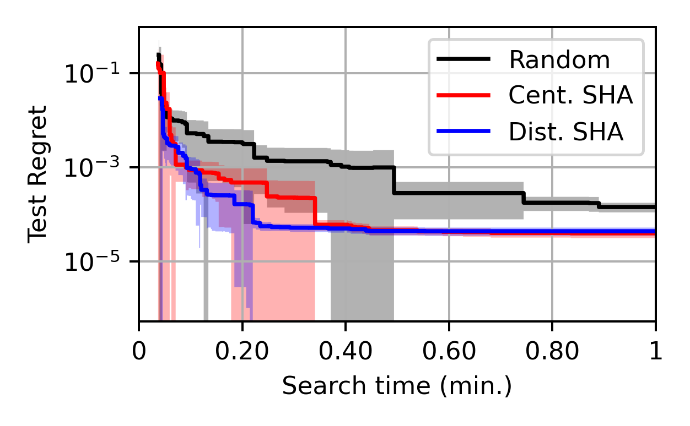
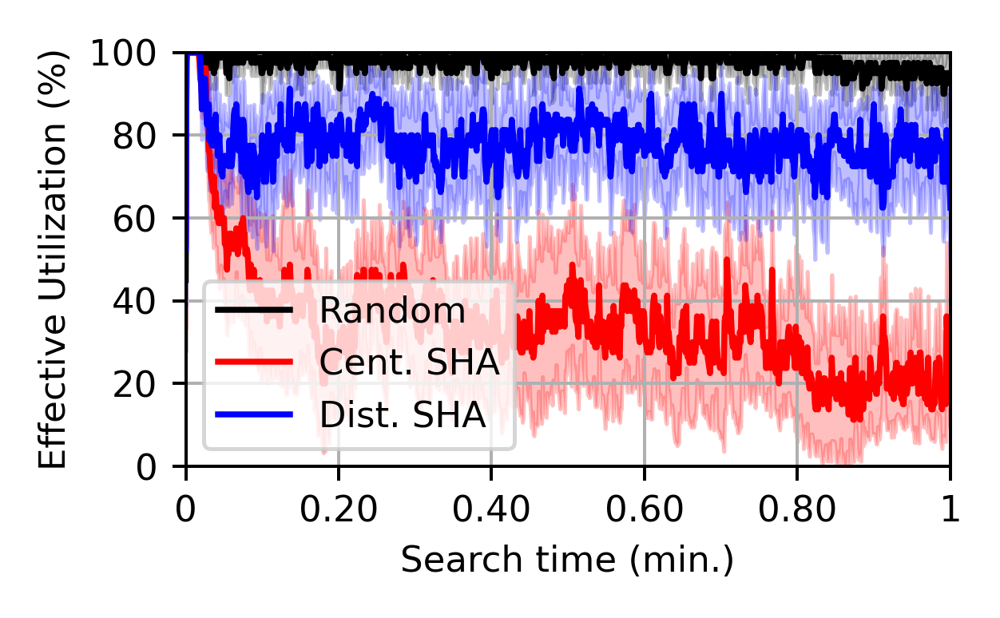

# Artifact Description (SC23)

## Reproducibility of Experiments


### Details about environment used for experiments

In this section, we provide the detailed installation used when running our experiments. These details can help reproduce exactly the environment. However, our results should not be sensitive to little changes.

The software used on the Polaris supercomputer at the Argonne Leadership Computing Facility for ou Hyperparameter optimization benchmarks is provided in:
- `infos/polaris-os.out`: information about the OS of the system.
- `infos/polaris-env.out`: information about the modules, conda and spack environments.

These files were generated by executing `./infos.sh polaris` from our loaded environment.

### Installation on Polaris at ALCF

On all the systems of the Argonne Leadership Computing Facility (ALCF) we used the `/lus/grand/projects` filesystem to have enough storage space for our installation as the user home directory `~/` is relatively small. The following set of instructions should be run from the location where the environment will be installed:

```console
git clone https://github.com/deephyper/scalable-bo.git
cd scalable-bo/
mkdir build && cd build/
../install/polaris.sh
```

This installation will create the `build/activate-dhenv.sh` script which can be sourced (e.g., from `scalable-bo` root directory `. ./build/activate-dhenv.sh`) to load the installed environment (i.e., activate Conda and Spack environments, also load the Redis configuration `redis.conf`).

The details about the installation steps are provided with comments in `scalable-bo/install/polaris.sh`.

The script will install:
- `deephyper`: Python package used for the Hyperparameter optimization algorithms and distribution of task evaluations. DeepHyper is installed with `[default,mpi,redis]` extra requirements. See [Install DeepHyper with pip](https://deephyper.readthedocs.io/en/latest/install/pip.html) to have details about all extra requirements.
- `deephyper-benchmark`: A library of benchmark for Hyperparameter optimization and other types of similar problems. See more details about these benchmarks at [deephyper/benchmark](https://github.com/deephyper/benchmark). In our script we specifically install the `ECP-Candle/Pilot1/Combo` benchmark used in the paper.
- `scalable-bo`: The code used to run our experiments.

### Running Experiments on Polaris at ALCF

On Polaris the experiments are run from `scalable-bo/experiments/polaris/dhb`. Go to the root directory of our experiments:

```console
cd scalable-bo/experiments/polaris/dhb
```

The outputs of the experiments will be stored in `scalable-bo/experiments/polaris/dhb/output` with a naming that is similar to job scripts. Create this directory: 

```console
mkdir output
```

In all our job scripts (`*.sh`) the `-A datascience` project is used. Replace this value by your own project allocation (e.g., `myprojectname`) with the following command:

```console
cd scalable-bo/experiments/polaris/dhb
sed -i '' 's/#PBS -A datascience/#PBS -A myprojectname/' *.sh
```

Now, in order to test the installation the following commands will submit a small debug jobs on two Polaris nodes::

```console
qsub dhb_combo-CBO-RF-UCB-2-3500-debug.sh
```

Then all experiments can be submitted similarly with `qsub`. Each job file is named according to `BenchmarkName-Algorithm-SurrogateModel-AcquisitionFunction-MultifidelityStrategy-NumberOfNodes-SearchDuration.sh` for example `dhb_combo-DBO-RF-UCB-SHA-480-10800.sh` corresponds to:
- `BenchmarkName = dhb_combo`
- `Algorithm = DBO` (Distributed Bayesian Optimization)
- `SurrogateModel = RF` (Random Forest)
- `AcquisitionFunction = UCB` (Upper Confidence Bound)
- `MultifidelityStrategy = SHA` (Successive Halving)
- `NumberOfNodes = 480`
- `SearchDuration = 10800` (in secondes)

Each experiment will create a new folder with similar naming inside `output`. Each of this result folder will contain:
- `results.csv` the main file which contains the metadata of each evaluated hyperparameter configurations (1 evaluation = 1 row).
- `context.yaml` metadata of the executed search (e.g., number of workers, problem description, parameters of the search).
- `deephyper*.log` some log file providing detailed information about the execution.

### Creating Figures

After executing the experiments, we use a semi-automated script to plot our figures `python -m scalbo.plot`. The `plot.yaml` file contains all the metadata necessary to describe the plots. The beginning of  this file `plot.yaml` describes where the experiments results are located as well as where the generated figures should be stored. Replace them with you current directory:

```console
sed -i '' "s_data-root: .*_data-root: $PWD/output_" plot.yaml
sed -i '' "s_figures-root: .*_figures-root: $PWD/figures" plot.yaml
```

Now the plots should able to be generated with:

```console
python -m scalbo.plot --config plot.yaml
```

## Run Simplified Experiments 

In this section, we provide a small scale example to demonstrate the code execution. However, it is important to note that the impact of the result is less due to the reduction in scale (only 8 workers) such as demonstrated in the original paper when using only 40 workers (in this example we will be using even fewer workers).

This example will run the centralized and distributed Bayesian optimization with 8 workers defined by the variable `NUM_WORKERS=8`. The benchmark used is `HPOBench/tabular/navalpropulsion` which can be found on the [deephyper/benchmark repository](https://github.com/deephyper/benchmark). [HPOBench](https://github.com/automl/HPOBench) is a benchmark proposed by the AutoML group from the Hyperparameter optimization research community. It contains different types of problems such Tabular data and Computer Vision. We decide to use the `navalpropulsion` benchmark which is a precomputed database of neural network architectures and hyperparameters for 100 training epochs. When running our experiments we simulate 1% of the real training time of neural networks to speed up the experiments (also 8 workers would not be enough with 100% of the real training time to put stress on the manager under the centralized architecture). Each optimization is repeated with 10 different random seeds (variable `random_states`) as the experiments are more affordable in this case.

1. Start by installing the required packages.

2. Then, the script to run these experiments are presented in `experiments/sc23-example/navalapropulsion`.

3. Then, Open and execute all the experiments with the script `./auto.sh`. Each experiment takes 70 secondes. There are 10 repetition of each experiments and 5 cases. There it will take about `10 * 5 * 70 = 3500` (a bit less than 1 hour to run all the experiments with each repetition).

4. Once the experiments are completed, the `output` folder should be filled with sub-folders where each of them contains a `results.csv` file. Also the `figures` folder should be filled with `cbo-vs-dbo` and `cbo-sha-vs-dbo-sha` which contains the figures of interest.

The `infos.yaml` contains information with `mean +/- standard error` where the keys are:
- `best_objective`: The best objective (validation error) observed during the search (maximization).
- `best_objective_timestamp`: The time at which the `best_objective` was found.
- `num_evaluations`: The number of evaluated configurations of hyperparameters.
- `utilization`: The worker utilization.

The `plot_test_objective_multi.png` contains the search trajectory of the test regret.

The `plot_utilization_multi.png` contains the worker utilization during the search.

In this setting, the `cbo-vs-dbo` (centralized against distributed) display similar performance for centralized and distributed because the manager of the centralized architecture is not overloaded (confirming results at small scale in the main experiments of our paper). Then, the `cbo-sha-vs-dbo-sha` (centralized against distributed both equipped with successive halving) display a manager for the centralized architecture that is being overloaded. The utilization is lower for centralized. and the distributed is able to evaluate more candidates which results in a better search trajectory.




